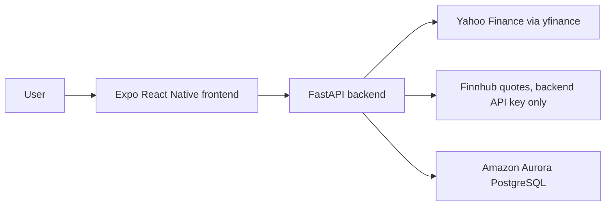

# Finzo Architecture

Finzo is split into a mobile/web frontend and a Python API backend.

## Request Flow

1. The user opens Finzo on web, Android, or iOS.
2. Expo React Native screens call the FastAPI backend through `frontend/services/api.ts`.
3. FastAPI routes validate requests with Pydantic schemas.
4. `market_data.py` fetches Yahoo historical OHLCV candles for backtests and falls back to mock candles if Yahoo fails.
5. `finnhub_live.py` fetches Finnhub REST quotes and can relay Finnhub WebSocket updates with `FINNHUB_API_KEY` kept server-side, then falls back to cached/mock live prices when needed.
6. Services run paper backtests, analyze sentiment, compare strategy variants, and build reports.
7. SQLAlchemy stores users, strategies, backtests, trades, sentiment inputs, sentiment scores, and reports.
8. Local development uses SQLite when `DATABASE_URL` is missing. Deployed environments can provide an Aurora PostgreSQL connection string.

## Safety Boundary

Finzo never places real orders, connects to brokerages, or provides financial advice. Every trade is simulated from generated mock data.
